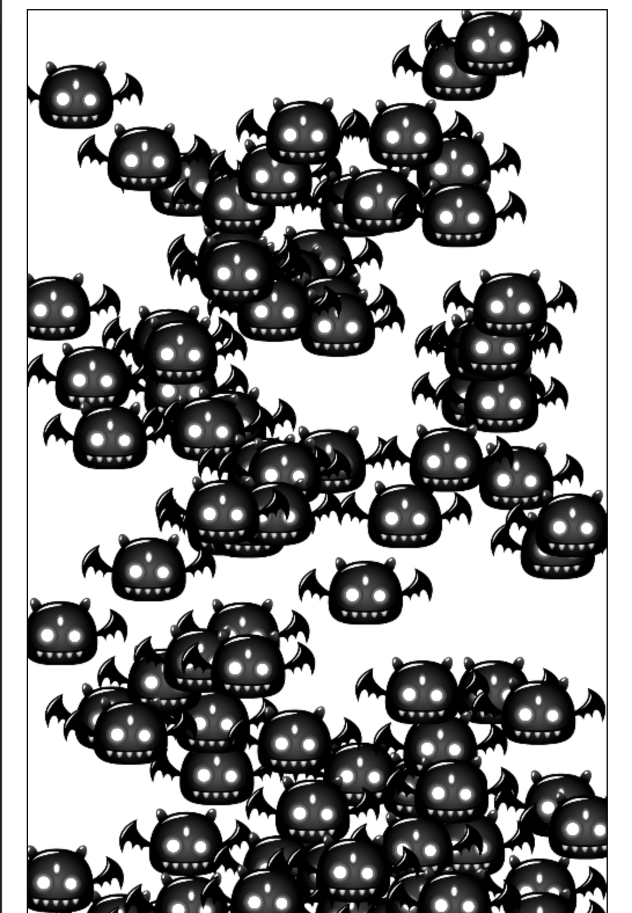

## Day003 - NPC Animations

**Project Name:** NPC Animations

**Description:** This project creates a simple enemy swarm game using JavaScript and the Canvas API.

### Preview

### Technologies

* JavaScript
* HTML5
* Canvas API

### Third Day of #100days100projects

Today is my third day of #100days100projects, and I am excited to share my enemy swarm background effect project. I
leaned a lot about canvas API and how to effectively manage swarm of enemies and randomize their movements

### Possible Improvements

* Add a player character that the user can control.
* Add different types of enemies with different behaviors.
* Implement a scoring system and difficulty levels.
* Add power-ups and other gameplay features.

### License

This project is licensed under the MIT License.