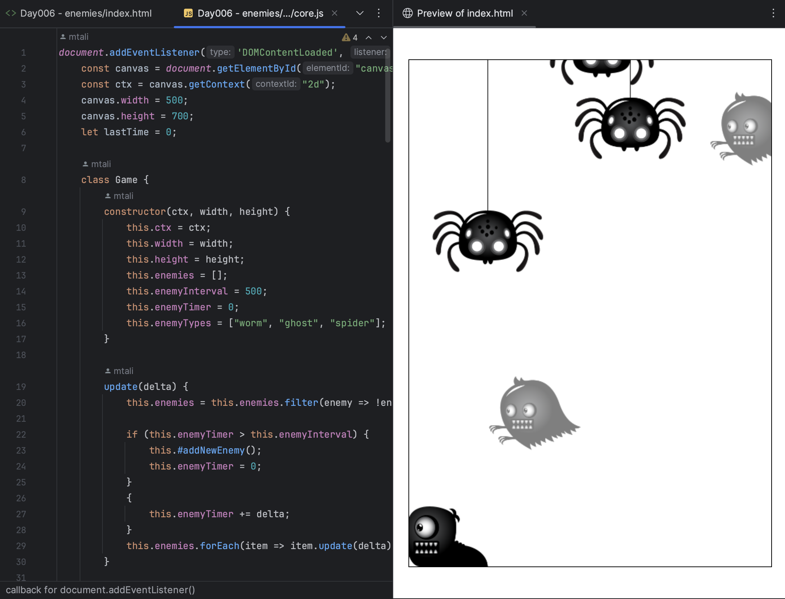

## Day006 - Enemies

### Description

This project illustrates the use of JS classes and inheritance to simplify creating enemies of different types,
properties and actions.

### Preview

### Technologies

* JavaScript
* HTML5
* Canvas API

### License

This project is licensed under the MIT License.