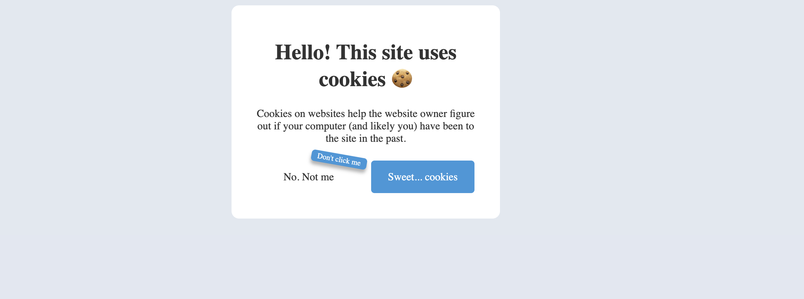

## Day008 - Cookies

### Description

Cookies are important for websites to work. This project presents a funny way of preventing user from clicking "No" when
website requests to store cookies.

### Preview

### Technologies

* JavaScript
* HTML5
* CSS Flex

### License

This project is licensed under the MIT License.