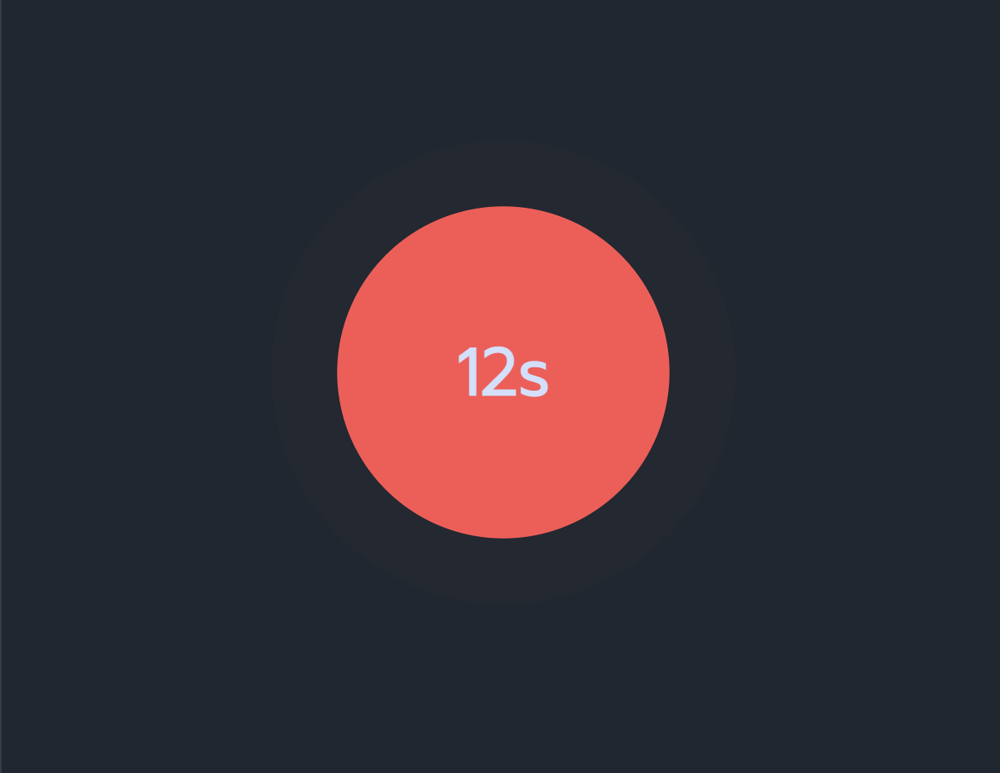

## Day028 - Pulses

### Description

A simple and visually appealing pulse  built using HTML, CSS, and JavaScript. This project features a circular timer with a pulsating animation, indicating the passage of time. The timer resets to zero after reaching 60 seconds.

### Preview

### Technologies

* JavaScript
* HTML5
* CSS

### License

This project is licensed under the MIT License.
